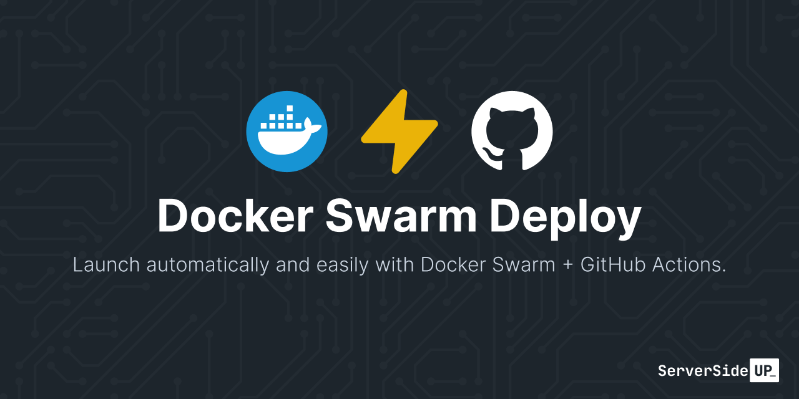
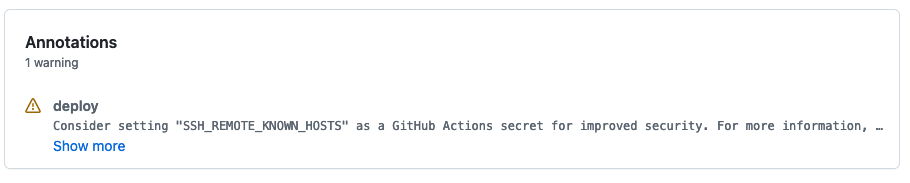
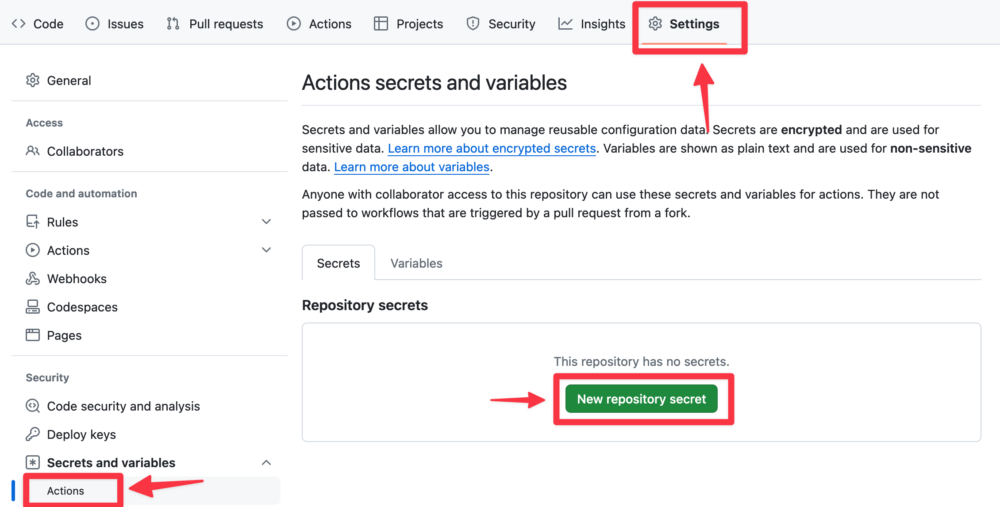

<p align="center">
		
</p>
<p align="center">
	<a href="https://github.com/serversideup/github-action-docker-swarm-deploy/blob/main/LICENSE" target="_blank"></a>
	<a href="https://github.com/sponsors/serversideup"></a>
  <br />
  <a href="https://community.serversideup.net"></a>
  <a href="https://serversideup.net/discord"></a>
</p>

# Docker Swarm Deploy with GitHub Actions
Hi! We're [Dan](https://twitter.com/danpastori) and [Jay](https://twitter.com/jaydrogers). We're a two person team with a passion for open source products. We created [Server Side Up](https://serversideup.net) to help share what we learn.

### Find us at:

* 📖 [Blog](https://serversideup.net) - get the latest guides and free courses on all things web/mobile development.
* 🙋 [Community](https://community.serversideup.net) - get friendly help from our community members.
* 🤵‍♂️ [Get Professional Help](https://serversideup.net/get-help) - get guaranteed responses within next business day.
* 💻 [GitHub](https://github.com/serversideup) - check out our other open source projects
* 📫 [Newsletter](https://serversideup.net/subscribe) - skip the algorithms and get quality content right to your inbox
* 🐥 [Twitter](https://twitter.com/serversideup) - you can also follow [Dan](https://twitter.com/danpastori) and [Jay](https://twitter.com/jaydrogers)
* ❤️ [Sponsor Us](https://github.com/sponsors/serversideup) - please consider sponsoring us so we can create more helpful resources

### Our Sponsors
All of our software is free an open to the world. None of this can be brought to you without the financial backing of our sponsors.

#### Individual Supporters
<!-- supporters --><a href="https://github.com/deligoez"></a>&nbsp;&nbsp;<a href="https://github.com/alexjustesen"></a>&nbsp;&nbsp;<a href="https://github.com/jeremykenedy"></a>&nbsp;&nbsp;<!-- supporters -->

# About this project
This is a GitHub Action intended to simplify the development experience while deploying with Docker Swarm.

### Features:
- 😃 Simple to use
- 🏗️ Bring your own container + configuration
- 💯 Replicate 100% of production from Development to CI to Deployment
- 💪 Use with self-hosted registries
- 🧮 Store MD5 hashes in environment variables for deployment
- 🔐 Use with private registries
- 🏠 Use .env files for deployment

# Usage
Here is an example workflow:

```yml
name: Production Deployment
on:
  push:
    branches:
      - main

jobs:
  deploy:
    needs: build
    runs-on: ubuntu-24.04
    steps:
      - uses: serversideup/github-action-docker-swarm-deploy@v3
        with:
          ssh_deploy_private_key: "${{ secrets.SSH_DEPLOY_PRIVATE_KEY }}"
          ssh_remote_hostname: "${{ secrets.SSH_REMOTE_HOSTNAME }}"
          registry: "ghcr.io"
          registry-username: "${{ github.actor }}"
          registry-token: "${{ secrets.GITHUB_TOKEN }}"
          stack_name: "${{ env.PROJECT_NAME }}"
          md5_file_path: "./.infrastructure/conf/traefik/prod/traefik.yml"
          md5_variable_name: "SPIN_MD5_HASH_TRAEFIK_YML"
          env_file_base64: "${{ secrets.ENV_FILE_BASE64 }}"
```
### Configuration options

| Parameter               | Description                                                                                     | Default                                              | Required |
|-------------------------|--------------------------------------------------------------------------------------------------|------------------------------------------------------|----------|
| docker_compose_file_path| Set your docker compose file path with the CLI options.                                          | `-c docker-compose.yml -c docker-compose.prod.yml`   | false    |
| env_file_base64         | The base64 encoded .env file to load into the container.                                         |                                                      | false    |
| log_level               | The log level to use for the Docker CLI.                                                         | `debug`                                              | false    |
| md5_file_path           | Set the path to the file you would like to get the MD5 checksum for.                             |                                                      | false    |
| md5_variable_name       | Set the name of the variable to store the MD5 checksum in.                                       | `MD5_CHECKSUM`                                       | false    |
| registry                | Comma-separated list of container registries to authenticate with (e.g., "docker.io,ghcr.io").   | `docker.io`                                          | false    |
| registry-token          | The token or password to use to authenticate with the container registry.                        |                                                      | ⚠️ true  |
| registry-username       | The username to use to authenticate with the container registry.                                 |                                                      | ⚠️ true  |
| ssh_deploy_private_key  | The private key you have authenticated to connect to your server via SSH.                        |                                                      | ⚠️ true  |
| ssh_deploy_user         | The user that you would like to connect as on the remote server via SSH.                         | `deploy`                                             | ⚠️ true  |
| ssh_remote_hostname     | The hostname or IP address of the server you want to connect to.                                 |                                                      | ⚠️ true  |
| ssh_remote_known_hosts  | The public key of your SSH server to validate we are connecting to the right server.             |                                                      | false    |
| ssh_remote_port         | The SSH port of the remote server you would like to connect to.                                  | `22`                                                 | false    |
| stack_name              | The name of your Docker stack.                                                                   |                                                      | ⚠️ true  |

### Setting "ssh_remote_known_hosts" value
For simplicity sake, we will automatically scan the known public SSH keys of your server and attempt to make a connection. The problem with this is it opens you up to a man-in-the-middle attack.

To ensure you're validating the identity of your server, you can set the `ssh_remote_known_hosts` input with the public key of your server. You can set this value to a GitHub secret like `SSH_REMOTE_KNOWN_HOSTS`:

```yml
- uses: serversideup/github-action-docker-swarm-deploy@v3
  with:
    registry-token: "${{ secrets.GITHUB_TOKEN }}"
    registry-username: "${{ github.actor }}"
    ssh_deploy_private_key: "${{ secrets.SSH_DEPLOY_PRIVATE_KEY }}"
    ssh_remote_hostname: "${{ secrets.SSH_REMOTE_HOSTNAME }}"
    ssh_remote_known_hosts: "${{ secrets.SSH_REMOTE_KNOWN_HOSTS }}"
    stack_name: "${{ env.PROJECT_NAME }}"
  env:
    SPIN_IMAGE_DOCKERFILE_PHP: "ghcr.io/${{ github.repository }}:${{ github.sha }}"
    SPIN_DEPLOYMENT_ENVIRONMENT: production
```
#### Setting the "ssh_remote_known_hosts" secret


You can set the `ssh_remote_known_hosts` secret by getting the public key of your server and setting it as a GitHub secret. You can run this from your **local machine** (not in GitHub Actions) to get the public key of your server:

```bash
ssh-keyscan -p 22 -H myserver.example.com 2>/dev/null | sort -u
```

Replace `myserver.example.com` with the hostname of your server. You can also change the port by changing `-p 22` to your desired port.

The output will look similar to this, with hashed hostnames:

```
|1|BfvcToAPMeAK0zR9FShCnP5CCaw=|ltUazkjjoIKsoBFQMF5yOTJt/Ks= ssh-ed25519 AAAAC3NzaC1lZDI1NTE5AAAAIBKIAz4U9GvgyBttgCnvi4AfBq3CdQ9XqAryrIyO1O60
|1|J/BpMKspk0BwPAxR28Dzc7gVGgw=|RAimV4/7iS4jlmFmDAfex/nKDUQ= ssh-rsa AAAAB3NzaC1yc2EAAAADAQABAAABgQChvNZNpcjdSXJWVdnhieQXRgBVUUwpexLz0dbDegUj68vrzXsgtrnGtf+sJlRhI6C7jBZDfxk2jXL1ASfxEQUqbvptZTG68uusD1DYx3wtb/kTqvJ3JkFuWJbt2zLyZktPrueHA9cvuquW46M6wSZN5AZddNitUZ09Bpb+dTVZkjbEDOiGoHRDj5M86e1rr/8UGNrAVZl/hckup3lfu3B3P0LKnGnMw+/DXIKvJiwVJ3OdHzyq6D/x9uNgcOUA7UPgUbV30gyFtWr2Az6Vn/ZolDOGasK9iI5WjvBdXwyWNwEnnR539RutiwbS/XTnb0Jj/fFS5NM2/AM3nCT37D4uQA7aJFka7keUTJZJIVanziz9Ty76lloweLDKHN2CyvUijjSx5HaqV9Dr2nTefTPPvzz1D9xU0WJX8KC77Wcu8qEjqSwNihJqucXQvq4xeBZ85OGPbvzAFYqZdjynzVsLP50E7kmdaW3VJx88hbg+vyXrJD1urcOVPNtGoMpN2Mc=
|1|cYUT42KbDx+rQD0YSpKgDxbFWBc=|D13n4gWdMyJ+C2nifoEEeFmezmE= ecdsa-sha2-nistp256 AAAAE2VjZHNhLXNoYTItbmlzdHAyNTYAAAAIbmlzdHAyNTYAAABBBN7wgADkhTHi7WER2pCZ5/10HBmhSIAq9zS1rWiBG5A8t2ATh5QnJ17XtPKXEJGPH8nogry/bZ+WKxI4zojGD+Q=
```

Copy the output and set it as a GitHub secret (usually called `SSH_REMOTE_KNOWN_HOSTS`).



#### Validate the known hosts file
If you need to validate the known hosts file, you can save it in a file on your local machine and attempt to SSH into your server with it:

```bash
ssh -p 22 -i /path/to/test_known_hosts_file myserver.example.com
```

If you cannot connect from your local machine, then you know there is an issue with the known hosts file itself.


### Getting the MD5 Checksum of a file
We include an optional input to get the MD5 checksum of a file. This is useful if you're working with Docker Configs and you only want the service to update if the file has changed. You just need to set the following inputs (a full example is available at the top of this document):

```yml
steps:
  - uses: serversideup/github-action-docker-swarm-deploy@v3
    with:
      md5_file_path: "./path/to/my/file.txt"
      md5_variable_name: "MY_FILE_MD5"
```

This will store the MD5 checksum of the file at `./path/to/my/file.txt` in the environment variable `MY_FILE_MD5`.

### Using an .env file
You can use an .env file to set environment variables for your container. This is useful if you're working with environment variables that are different for each environment. You can set the .env file as a base64 encoded string and it will be decoded and loaded into the container.

```yml
steps:
  - uses: serversideup/github-action-docker-swarm-deploy@v3
    with:
      env_file_base64: "${{ secrets.ENV_FILE_BASE64 }}"
```

To set the value of `ENV_FILE_BASE64`, you can use the following command:

```bash
cat .env | base64
```

Any variable set in the .env file will be available to the deployment to be used in your docker-compose.yml file.

For example, if you have a .env file with the following:

```
DB_HOST=mysql
DB_PORT=3306
DB_USER=root
DB_PASSWORD=password
```

Then you can use the following in your docker-compose.yml file: 

```yml
services:
  mysql:
    environment:
      - DB_HOST=${{ env.DB_HOST }}
      - DB_PORT=${{ env.DB_PORT }}
      - DB_USER=${{ env.DB_USER }}
      - DB_PASSWORD=${{ env.DB_PASSWORD }}
```

### Security Disclosures
If you find a security vulnerability, please let us know as soon as possible.

[View Our Responsible Disclosure Policy →](https://www.notion.so/Responsible-Disclosure-Policy-421a6a3be1714d388ebbadba7eebbdc8)